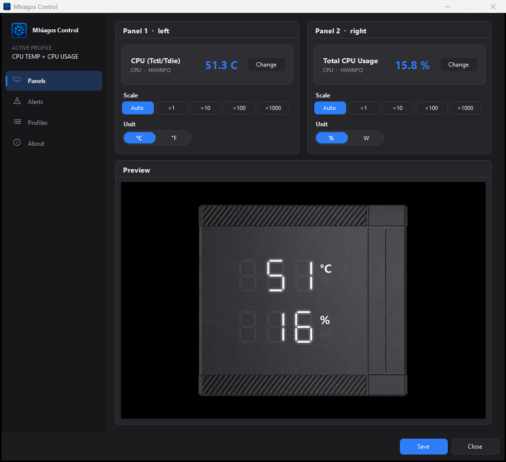
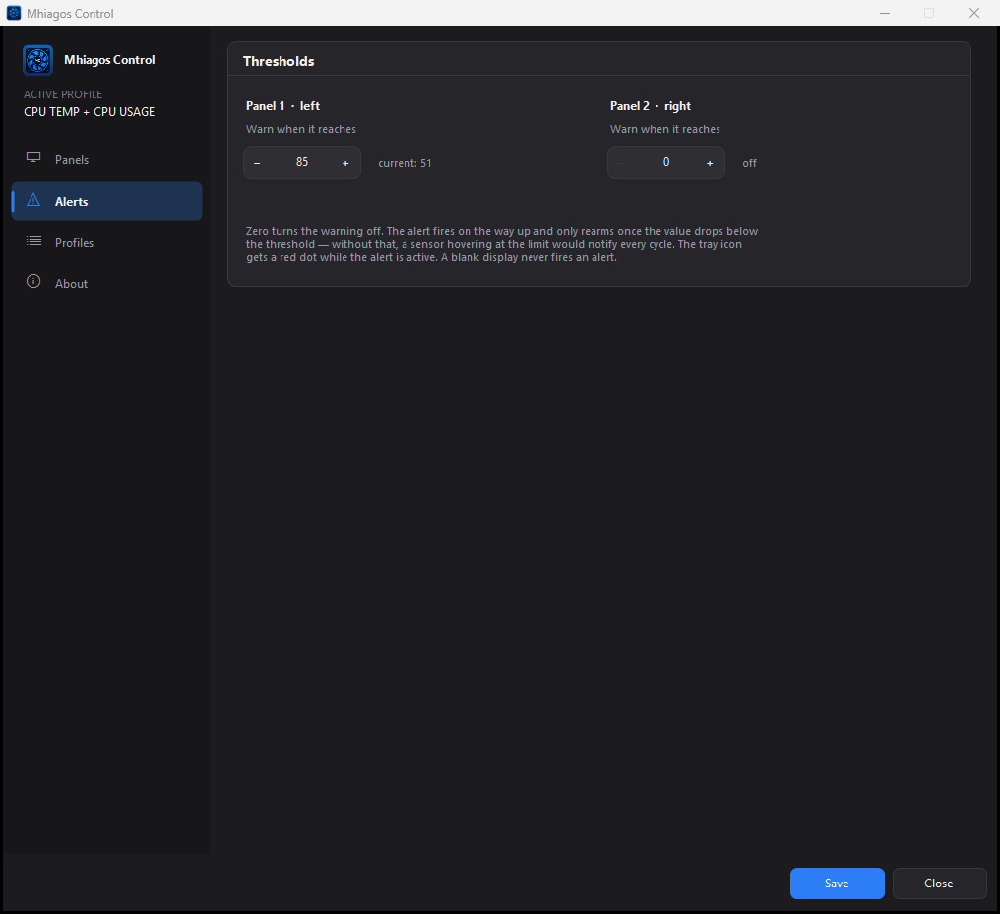
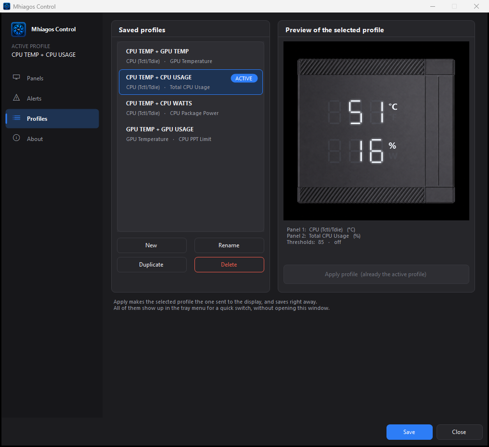
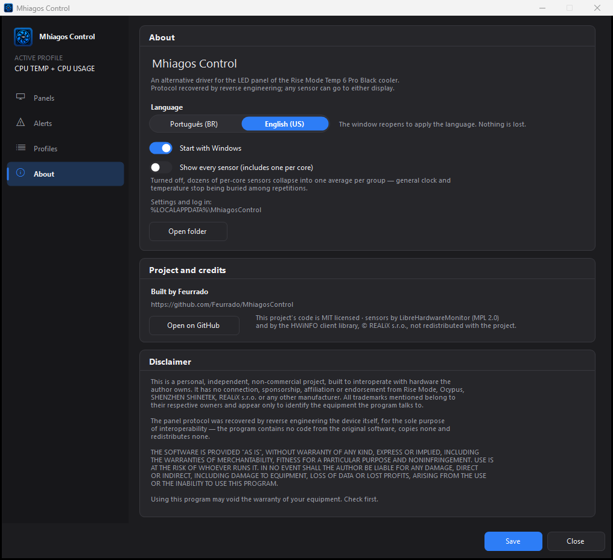
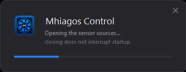

# Mhiagos Control

An alternative driver for the LED panel of the **Rise Mode Temp 6 Pro Black air
cooler**, replacing the bundled *CPU TEMP Monitor* software
(SHENZHEN SHINETEK / Ocypus brand).

It can display **any sensor** on the two 3-digit panels, instead of the two
fixed metrics the factory software offers.

> The interface speaks **Brazilian Portuguese and English**, picked from the
> Windows language on first run and switchable under *About*. Screenshots here
> are in English.

---

## Screens

| | |
|:--:|:--:|
|  |  |
| **Panels** — pick the sensor, scale and units for each display, with a live preview over the part | **Alerts** — a threshold per display, rearmed on the way down |
|  |  |
| **Profiles** — each saved set shows what it puts on the display, previewed before you commit to it | **About** — language, autostart, credits and disclaimer |

The preview reproduces the top view of the cooler and its seven-segment display
as it looks on the device: the two panels stacked, `°C`/`°F` over `%`/`W`, white
digits with no frame.

### Sensor picker


The sensor for each display is chosen in a dedicated window, opened by the
*Trocar* (Change) button. There the list does not share height with scale, units
and preview, so twice as many rows fit — and the category pills narrow the search
down to the hardware you are after. Text search matches name, category and type,
all terms at once. Double click or <kbd>Enter</kbd> confirms.

### Profiles

A profile is a saved pair of sensors plus their units, scale and thresholds.
The list shows what each one sends to the display, and selecting one previews it
on the part before *Apply profile* makes it the live one — applying saves right
away, so an "active" profile always survives closing the window. Every profile
also appears in the tray menu, for switching without opening the settings at all.

### Loading screen



It never shows up on its own: it only appears if the tray icon is clicked while
the sensor sources are still opening — whoever noticed the delay is the one who
wants an explanation. Closing it interrupts nothing.

> The readings in the screenshots are **illustrative** — the interface was
> rendered with a representative sensor list, not measured on a specific machine.

---

## Panel protocol

Recovered by reverse engineering: USB capture of the original software
(USBPcap), byte-by-byte decoding, and validation by writing directly to the
device.

**Device:** `VID 0x1A2C` / `PID 0x4984`
The firmware identifies itself as a *"USB Gaming Keyboard"* — a generic
descriptor reused from the microcontroller vendor. The real data channel is the
*vendor-defined* HID collection with `UsagePage 0xFF01`.

**Transport:** control transfer on EP0 — HID class `SET_REPORT`.

```
Setup: 21 09 07 03 01 00 40 00
       │  │  │  │  │     └── wLength = 64
       │  │  │  │  └──────── wIndex  = 1 (interface)
       │  │  └──┴─────────── wValue  = 0x0307 (type 3 = Feature, ReportID 7)
       │  └───────────────── bRequest = 0x09 (SET_REPORT)
       └──────────────────── bmRequestType = 0x21 (OUT | Class | Interface)
```

**Payload — 64 bytes:**

| Byte | Contents |
|------|----------|
| `[0]` | `0x07` — ReportID |
| `[1]` | panel 1, hundreds |
| `[2]` | panel 1, tens |
| `[3]` | panel 1, units |
| `[4]` | flags — `bit0 (0x01)` = °F ; `bit4 (0x10)` = % |
| `[5]` | panel 2, hundreds |
| `[6]` | panel 2, tens |
| `[7]` | panel 2, units |
| `[8..63]` | `0x00` |

Digits are sent **separately, one per byte, in plain decimal** — not packed BCD,
not a binary integer. To show `73`, you send `0`, `7`, `3`. Codes `0x0A`–`0x0F`
**blank** the digit.

**No checksum, no encryption, no sequence number.**

The digit byte is a **lookup index into a firmware table**, not a segment
bitmap. The proof is `0x00`: a bitmap would light nothing, and it lights `0`.
So there is no way to draw shapes or animate individual segments — the panel
writes the ten digits and nothing else. To sweep what is left of the protocol,
see `tools\Probe.cs` under *Tools*.

### Flags (`report[4]`)

The two bits are **independent** — all four combinations are valid:

| Value | Panel 1 | Panel 2 |
|-------|---------|---------|
| `0x00` | °C | W |
| `0x01` | °F | W |
| `0x10` | °C | % |
| `0x11` | °F | % |

The bit only **lights the symbol**; converting the number is the software's job.
The original software uses the hundreds digit exclusively for Fahrenheit, which
goes past 99 — but the full `000–999` range is available on both panels,
validated by writing.

### Watchdog

The firmware blanks the panel if it stops receiving updates, so resending
continuously is mandatory. The original software uses a **~1105 ms** cadence
(measured: under 1% deviation). This project uses 1100 ms.

---

## Sensor sources

The app has two sources and picks the best available at startup.

### HWiNFO (preferred)

`engine\api-ms-win-core-sysinfo-825-64.dll` is the **HWiNFO client library**
(HWiNFO32 Client Library 8.25, REALiX s.r.o.), shipped by the cooler vendor
under a Windows API file name. It is the same engine the original software uses
to read temperature — and the reason it works where LibreHardwareMonitor fails:
its driver is WHQL-signed by Microsoft and is **not** on the vulnerable driver
blocklist.

The library exports **797 functions, none of them named** — ordinals only. The
mapping below was recovered from the original `DeviceDriver.exe` by locating the
`GetProcAddress` calls and decoding the call sites. All are `cdecl`:

| Ordinal | Signature | Role |
|---------|-----------|------|
| `850` | `int Init(0xC0)` | initialize; returns 0 on success |
| `156` | `int GetCount()` | number of sensor groups |
| `263` | `int (void)` | called once per cycle, after the count |
| `678` | `int (int i)` | prepares group `i` |
| `952` | `int (int i, char* buf, int len)` | name of group `i` |
| `641` | `int (int class, int i, int j, void* elem)` | reading `j` of group `i`; `0` ends the series |
| `398`, `613` | — | resolved and validated by the original, not used for reading |

The element returned by `641` is **464 bytes** (`0x1D0`):

| Offset | Field |
|--------|-------|
| `+0x08` | value (`double`) |
| `+0x10` | unit, ASCII (`"°C"`, `"W"`, `"MHz"`, `"MB"`…) |
| `+0x30` | hardware category (`10` system, `11` CPU, `12` motherboard, `13` GPU, `15` disk, `16` network) |
| `+0x148` | reading label |

The first argument of `641` is the **reading class**: `1` temperature,
`2` voltage, `3` fan, `4` current, `5` power, `6` clock, `7` usage, `8` other.
The original software only queries class 1 — which is why it shows temperature
via HWiNFO and watts via the other source.

`Init` fails with code **1** without elevation, because the library needs to
register and start its driver.

> **The DLL is not in this repository** — it is third-party commercial software
> and cannot be redistributed (see *License*). To enable this source, copy
> `api-ms-win-core-sysinfo-825-64.dll` from the *CPU TEMP Monitor* installation
> that came with the product (`C:\Program Files\CPU TEMP Monitor\`) into `lib\`
> before building. Without it `build.ps1` warns and the app starts using only
> the fallback source.

### LibreHardwareMonitor (fallback)

Used only when HWiNFO is unavailable. It covers GPU, CPU usage, memory, disk and
network with no driver of its own, but **returns zero** for CPU temperature,
power and real clock: those need kernel-mode access, and the driver it uses for
that (WinRing0 1.2.0.5, CVE-2020-14979) is on the Windows blocklist. Antivirus
removes it **on every startup**, with an alert.

That is why it is not opened when HWiNFO responds: there is nothing to gain from
paying that price.

---

## Requirements

- Windows 10/11 x64
- .NET Framework 4.7.2+ (present by default)
- **Administrator privileges** — both sources need to start a driver

No .NET SDK required: it builds with the `csc.exe` that ships with Windows.

## Building

```powershell
powershell -ExecutionPolicy Bypass -File .\build.ps1
```

Output goes to `bin\MhiagosControl.exe`.

> `-ExecutionPolicy Bypass` is needed because Windows blocks `.ps1` scripts by
> default. The switch applies **to that process only** and does not change the
> machine configuration — there is no need to run `Set-ExecutionPolicy`.

> **When distributing:** the `bin\engine\` folder is part of the package. Copying
> just the `.exe` silently costs the app CPU temperature, power and clock — it
> falls back to the other source without saying so on screen, only in the log.

## Using it

1. Run `bin\MhiagosControl.exe` (it asks for elevation).
2. On first run the settings window opens. Pick the sensor and units for each
   panel.
3. The icon stays in the tray. Double click reopens the settings.

*Save* writes to disk and leaves the window open — panel tweaks rarely come one
at a time, so closing on every save just meant reopening. *Close* asks before
discarding anything unsaved.

The original software does not need to be installed.

### Application data

Lives in `%LOCALAPPDATA%\MhiagosControl\` — reachable from the tray menu under
*Abrir pasta de dados* (Open data folder):

| File | Contents |
|------|----------|
| `config.ini` | profiles, sensor per panel, units, thresholds, interface language |
| `log.txt` | diagnostics, rotated at 512 KB (`log.txt.1`) |

Settings from older versions (including from when the project was called
*RiseModePanel*) are migrated on first start.

### Implementation notes

- Sensor polling runs on **its own thread**: walking the hardware takes tens to
  hundreds of ms and would freeze the interface if done on the UI thread. Only
  the tooltip update goes back to the UI.
- The cadence is **compensated**: the loop subtracts the time spent in the cycle,
  holding a real 1100 ms regardless of machine load.
- **Single instance** enforced by a mutex — two instances would fight over the
  panel.
- The HWiNFO library exposes no single-sensor query, so every cycle
  **re-enumerates** everything. The cost is one memory copy per reading,
  irrelevant at a one-second cadence.
- Per-core sensors are **collapsed into averages** (clock, power, voltage, usage)
  so they do not bury the general ones. Can be turned off under *Mostrar todos os
  sensores* (Show all sensors).
- Fahrenheit conversion applies only to `Temperature` sensors.
- The **unit comes from the source**, not from the sensor type: HWiNFO reports
  memory in `MB` and the generic type label claimed `GB` over the wrong number.
  `MB` readings are converted to `GB` and shown with one decimal (`11.6 GB`).
- The unit selector of panel 2 **follows the metric**: picking a power sensor
  lights `W`, a usage sensor lights `%`.
- Values above 999 are clamped by the hardware; the tooltip flags this with
  `[excede 999]`. Per-sensor divisors let larger metrics fit.
- **Autostart** via a Scheduled Task with `/rl highest`: the registry `Run` key
  does not work for elevated applications.
- `SessionEnding` stops the thread before closing the sources.
- The **loading screen lives on its own thread**, with its own message loop.
  Hosted on the main thread it froze: while the driver starts, `LoadLibrary`
  holds the loader lock, Windows marks the window as hung and starts swallowing
  clicks — there was no way to close it.
- **Scrollbars are drawn by the app.** The native one shows up as a bright
  streak over the dark card even with `DarkMode_Explorer`, and accepts neither a
  thickness nor a radius. Hiding it has a side effect: a `ListBox` only responds
  to the wheel while its native scrollbar is visible, so the wheel is handled by
  hand too, through `TopIndex`.
- List height is **rounded down to a multiple of the row**; the remainder becomes
  panel padding. Without it the last row showed up cut in half, as if there were
  a hidden item where there was none.
- **Switching language reopens the window** instead of relabelling it in place.
  Relabelling would need every control to carry its string key and know how to
  re-translate itself — dozens of places, and whatever was missed would sit there
  in the old language unnoticed. Rebuilding leaves no corner untranslated.
  Pending edits are written to the profile first, so nothing is lost.
- Category names are **stored in Portuguese and translated at draw time**. They
  are grouping keys, not display text; translating them at the source would break
  the comparison that puts a sensor under the right heading.
- Sensor **search matches both names** of a category, so typing "memory" finds
  what the English UI calls Memory and the config calls `Memória`.

---

## Tools

`tools\Probe.cs` — an interactive protocol probe, for sweeping what has not been
mapped yet: digit codes above `0x0F`, the six bits of `report[4]` with no known
use, the 56 bytes the original software always zeroes, other ReportIDs, and the
fastest cadence the firmware accepts.

```powershell
powershell -ExecutionPolicy Bypass -File .\tools\build-probe.ps1
.\bin\Probe.exe
```

A background loop resends the current frame every 400 ms — without it the
watchdog blanks the panel while you are looking at it. **No elevation needed:**
speaking HID to the device involves no driver.

| Command | Effect |
|---------|--------|
| `b <i> <hex>` | write one byte at position `i` of the frame |
| `v <i>` | sweep `00`–`FF` at position `i`, step by step |
| `va <i> [ms]` | the same sweep, automatic |
| `r <hex...>` | replace the whole frame |
| `hz <ms>` | change the resend cadence |
| `anim [ms]` | animate the digits, to measure the refresh limit |
| `ids` | try other ReportIDs |
| `q` | quit |

---

## What this project avoids from the original software

- **Telemetry** to `upgrade-1318931438.cos.ap-beijing.myqcloud.com` (automatic
  firmware and software updates from a bucket in China)
- **The WinRing0 driver**, which the original also loads through its second
  sensor source and which Windows blocks today
- Fixed metrics: here any sensor can go to any panel

---

## License

**MIT** — see [`LICENSE`](LICENSE). Use, modify and redistribute freely, keeping
the copyright notice.

The license covers **the code in this repository**. Dependencies have their own
licenses and are not covered by it:

| Component | License |
|-----------|---------|
| `src/`, `tools/`, `build.ps1`, generated `assets/` | MIT |
| `lib/LibreHardwareMonitorLib.dll` | MPL 2.0 (see `lib/LibreHardwareMonitor-LICENSE.txt`) |
| `engine\api-ms-win-core-sysinfo-825-64.dll` | commercial, © REALiX s.r.o. — **do not redistribute**, not present in this repository |

---

## Credits

- [LibreHardwareMonitor](https://github.com/LibreHardwareMonitor/LibreHardwareMonitor) —
  fallback source (MPL 2.0). License in `lib/LibreHardwareMonitor-LICENSE.txt`.
- **HWiNFO32 Client Library** — © REALiX s.r.o. A **commercial** library,
  licensed to the cooler vendor and not to this project. The copy in `engine\`
  came from the software installation that shipped with the product and serves
  personal use on the owner's own machine. **Do not redistribute.** For
  legitimate use in your own software, license the SDK from REALiX or consume
  HWiNFO through its documented shared-memory interface.
- Panel protocol: reverse engineered for interoperability with hardware the
  author owns.
- Built by [Feurrado](https://github.com/Feurrado).

---

## Disclaimer

This is a **personal, independent, non-commercial project**, built to
interoperate with hardware the author owns. It has no connection, sponsorship,
affiliation or endorsement from Rise Mode, Ocypus, SHENZHEN SHINETEK,
REALiX s.r.o. or any other manufacturer. All trademarks mentioned belong to
their respective owners and appear only to identify the equipment the program
talks to.

The panel protocol was recovered by **reverse engineering the device itself**,
for the sole purpose of interoperability — the program contains no code from the
original software, copies none and redistributes none.

> THE SOFTWARE IS PROVIDED "AS IS", WITHOUT WARRANTY OF ANY KIND, EXPRESS OR
> IMPLIED, INCLUDING THE WARRANTIES OF MERCHANTABILITY, FITNESS FOR A PARTICULAR
> PURPOSE AND NONINFRINGEMENT. USE IS AT THE RISK OF WHOEVER RUNS IT. IN NO EVENT
> SHALL THE AUTHOR BE LIABLE FOR ANY DAMAGE, DIRECT OR INDIRECT, INCLUDING
> DAMAGE TO EQUIPMENT, LOSS OF DATA OR LOST PROFITS, ARISING FROM THE USE OR THE
> INABILITY TO USE THIS PROGRAM.

Using this program may **void the warranty of your equipment**. Check first.

The same text appears inside the application, on the *Sobre* (About) tab.
