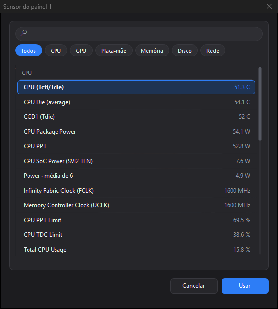
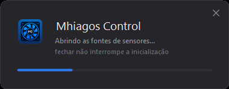

# Mhiagos Control

Driver alternativo para o painel do **air cooler Rise Mode Temp 6 Pro Black**,
substituindo o software original *CPU TEMP Monitor*
(SHENZHEN SHINETEK / marca Ocypus).

Permite exibir **qualquer sensor** do sistema nos dois painéis de 3 dígitos,
em vez das duas métricas fixas que o software de fábrica oferece.
 
---

## Telas

| | |
|:--:|:--:|
|  |  |
| **Painéis** — escolha o sensor de cada mostrador, a escala e as unidades, com prévia ao vivo sobre a peça | **Alertas** — limiar por mostrador, com rearme na descida |
|  |  |
| **Perfis** — conjuntos salvos, trocáveis pelo menu da bandeja | **Sobre** — início automático, créditos e isenção de responsabilidade |

A prévia reproduz a vista superior do cooler e o mostrador de sete segmentos
como ele é no aparelho: os dois painéis empilhados, `°C`/`°F` sobre `%`/`W`,
dígitos brancos sem moldura.

### Escolha do sensor



O sensor de cada mostrador é escolhido numa janela dedicada, aberta pelo botão
*Trocar*. Ali a lista não divide altura com escala, unidade e prévia, então
cabem duas vezes mais linhas — e as pílulas de categoria reduzem a busca ao
hardware procurado. Busca por texto casa nome, categoria e tipo, todos os termos
ao mesmo tempo. Duplo clique ou <kbd>Enter</kbd> confirmam.

### Tela de carregamento



Não aparece sozinha: só surge se o ícone da bandeja for clicado enquanto as
fontes de sensores ainda estão abrindo — quem estranhou a demora é quem quer
explicação. Fechá-la não interrompe nada.

> As leituras que aparecem nas capturas são **ilustrativas** — a interface foi
> renderizada com uma lista de sensores representativa, não medida de uma
> máquina específica.

---

## Protocolo do painel

Levantado por engenharia reversa: captura USB do software original (USBPcap),
decodificação byte a byte e validação por escrita direta no dispositivo.

**Dispositivo:** `VID 0x1A2C` / `PID 0x4984`
O firmware se identifica como *"USB Gaming Keyboard"* — descritor genérico
reaproveitado do fabricante do microcontrolador. O canal real de dados é a
coleção HID *vendor-defined* com `UsagePage 0xFF01`.

**Transporte:** transferência de controle no EP0 — `SET_REPORT` da classe HID.

```
Setup: 21 09 07 03 01 00 40 00
       │  │  │  │  │     └── wLength = 64
       │  │  │  │  └──────── wIndex  = 1 (interface)
       │  │  └──┴─────────── wValue  = 0x0307 (tipo 3 = Feature, ReportID 7)
       │  └───────────────── bRequest = 0x09 (SET_REPORT)
       └──────────────────── bmRequestType = 0x21 (OUT | Class | Interface)
```

**Payload — 64 bytes:**

| Byte | Conteúdo |
|------|----------|
| `[0]` | `0x07` — ReportID |
| `[1]` | centena do painel 1 |
| `[2]` | dezena do painel 1 |
| `[3]` | unidade do painel 1 |
| `[4]` | flags — `bit0 (0x01)` = °F ; `bit4 (0x10)` = % |
| `[5]` | centena do painel 2 |
| `[6]` | dezena do painel 2 |
| `[7]` | unidade do painel 2 |
| `[8..63]` | `0x00` |

Os dígitos são enviados **separados, um por byte, em decimal direto** — não é BCD
compactado nem inteiro binário. Para exibir `73`, envia-se `0`, `7`, `3`.
Os códigos `0x0A`–`0x0F` **apagam** o dígito.

**Sem checksum, sem criptografia, sem número de sequência.**

O byte de dígito é um **índice de tabela no firmware**, não um mapa de
segmentos. A prova é `0x00`: se fosse bitmap acenderia nada, e acende o `0`.
Não há, portanto, como desenhar figuras ou animar segmentos avulsos — o painel
escreve os dez algarismos e mais nada. Para varrer o que resta do protocolo,
veja `tools\Probe.cs` em *Ferramentas*.

### Flags (`report[4]`)

Os dois bits são **independentes** — as quatro combinações são válidas:

| Valor | Painel 1 | Painel 2 |
|-------|----------|----------|
| `0x00` | °C | W |
| `0x01` | °F | W |
| `0x10` | °C | % |
| `0x11` | °F | % |

O bit apenas **acende o símbolo**; a conversão numérica é responsabilidade do
software. O software original usa a centena exclusivamente para Fahrenheit,
que ultrapassa 99 — mas a faixa `000–999` está integralmente disponível nos
dois painéis, validada por escrita.

### Watchdog

O firmware apaga o painel se parar de receber atualizações. É obrigatório
reenviar continuamente. O software original usa cadência de **~1105 ms**
(medida: desvio inferior a 1%). Este projeto usa 1100 ms.

---

## Fontes de sensores

O aplicativo tem duas fontes e escolhe a melhor disponível no arranque.

### HWiNFO (preferida)

`engine\api-ms-win-core-sysinfo-825-64.dll` é a **biblioteca cliente do HWiNFO**
(HWiNFO32 Client Library 8.25, REALiX s.r.o.), distribuída pelo fabricante do
cooler com nome de API do Windows. É o mesmo motor que o software original usa
para ler temperatura — e a razão de ele funcionar onde a LibreHardwareMonitor
falha: seu driver é assinado WHQL pela Microsoft e **não** consta na lista de
drivers vulneráveis.

A biblioteca exporta **797 funções, nenhuma com nome** — só por ordinal. A
correspondência abaixo foi recuperada do `DeviceDriver.exe` original,
localizando os `GetProcAddress` e decodificando os *call sites*. Todas são
`cdecl`:

| Ordinal | Assinatura | Papel |
|---------|-----------|-------|
| `850` | `int Init(0xC0)` | inicializa; devolve 0 em caso de sucesso |
| `156` | `int GetCount()` | quantidade de grupos de sensores |
| `263` | `int (void)` | chamada uma vez por ciclo, após a contagem |
| `678` | `int (int i)` | prepara o grupo `i` |
| `952` | `int (int i, char* buf, int tam)` | nome do grupo `i` |
| `641` | `int (int classe, int i, int j, void* elem)` | leitura `j` do grupo `i`; `0` encerra a série |
| `398`, `613` | — | resolvidos e validados pelo original, não usados na leitura |

O elemento devolvido por `641` tem **464 bytes** (`0x1D0`):

| Offset | Campo |
|--------|-------|
| `+0x08` | valor (`double`) |
| `+0x10` | unidade, ASCII (`"°C"`, `"W"`, `"MHz"`, `"MB"`…) |
| `+0x30` | categoria de hardware (`10` sistema, `11` CPU, `12` placa-mãe, `13` GPU, `15` disco, `16` rede) |
| `+0x148` | rótulo da leitura |

O primeiro argumento de `641` é a **classe de leitura**: `1` temperatura,
`2` voltagem, `3` ventoinha, `4` corrente, `5` potência, `6` clock, `7` uso,
`8` outros. O software original só consulta a classe 1 — daí ele exibir
temperatura pelo HWiNFO e watts pela outra fonte.

O `Init` falha com código **1** sem elevação, porque a biblioteca precisa
registrar e subir seu driver.

> **A DLL não está neste repositório** — é software comercial de terceiros e
> não pode ser redistribuída (veja *Créditos e licenças*). Para habilitar essa
> fonte, copie `api-ms-win-core-sysinfo-825-64.dll` da instalação do *CPU TEMP
> Monitor* que acompanha o produto (`C:\Program Files\CPU TEMP Monitor\`) para
> `lib\` antes de compilar. Sem ela o `build.ps1` avisa e o aplicativo sobe
> usando apenas a fonte de reserva.

### LibreHardwareMonitor (reserva)

Usada apenas quando o HWiNFO não está disponível. Cobre GPU, uso de CPU,
memória, disco e rede sem driver próprio, mas **devolve zero** em temperatura,
potência e clock real do processador: esses exigem acesso em modo kernel, e o
driver que ela usa para isso (WinRing0 1.2.0.5, CVE-2020-14979) está na lista de
bloqueio do Windows. O antivírus o remove **a cada inicialização**, com alerta.

É por isso que ela não é aberta quando o HWiNFO responde: não há o que ganhar
pagando esse preço.

---

## Requisitos

- Windows 10/11 x64
- .NET Framework 4.7.2+ (presente por padrão)
- **Privilégio administrativo** — as duas fontes precisam subir um driver

Não exige SDK do .NET: compila com o `csc.exe` que acompanha o Windows.

## Compilar

```powershell
powershell -ExecutionPolicy Bypass -File .\build.ps1
```

Saída em `bin\MhiagosControl.exe`.

> O `-ExecutionPolicy Bypass` é necessário porque o Windows barra scripts `.ps1`
> por padrão. O parâmetro vale **apenas para esse processo** e não altera a
> configuração da máquina — não é preciso rodar `Set-ExecutionPolicy`.

> **Atenção ao distribuir:** a pasta `bin\engine\` faz parte do conjunto. Copiar
> só o `.exe` faz o aplicativo perder silenciosamente temperatura, potência e
> clock da CPU — ele cai na fonte de reserva sem avisar em tela, apenas no log.

## Usar

1. Execute `bin\MhiagosControl.exe` (pede elevação).
2. Na primeira execução abre a janela de configuração. Escolha o sensor de
   cada painel e as unidades.
3. O ícone fica na bandeja. Duplo clique reabre a configuração.

O software original não precisa estar instalado.

### Dados do aplicativo

Ficam em `%LOCALAPPDATA%\MhiagosControl\` — acessível pelo menu da bandeja em
*Abrir pasta de dados*:

| Arquivo | Conteúdo |
|---------|----------|
| `config.ini` | perfis, sensor de cada painel, unidades, limiares |
| `log.txt` | diagnóstico, com rotação em 512 KB (`log.txt.1`) |

Configurações de versões antigas (inclusive da época em que o projeto se
chamava *RiseModePanel*) são migradas no primeiro arranque.

### Notas de implementação

- A leitura de sensores roda em **thread própria**: percorrer o hardware leva
  dezenas a centenas de ms e travaria a interface se fosse feita na thread de
  UI. Só a atualização do tooltip volta para a UI.
- A cadência é **compensada**: o laço desconta o tempo gasto no ciclo, mantendo
  1100 ms reais independentemente da carga da máquina.
- **Instância única** garantida por mutex — duas instâncias disputariam o painel.
- A biblioteca do HWiNFO não expõe consulta individual, então cada ciclo
  **reenumera** tudo. O custo é uma cópia de memória por leitura, irrelevante na
  cadência de um segundo.
- Sensores por núcleo são **resumidos em médias** (clock, potência, tensão, uso),
  para não enterrar os sensores gerais. Desligável em *Mostrar todos os sensores*.
- A conversão para Fahrenheit só se aplica a sensores do tipo `Temperature`.
- A **unidade vem da fonte**, não do tipo do sensor: o HWiNFO devolve memória em
  `MB` e o rótulo genérico do tipo dizia `GB` sobre o número errado. Leituras em
  `MB` são convertidas para `GB` e exibidas com uma casa (`11.6 GB`).
- O seletor de unidade do painel 2 **acompanha a métrica**: escolher um sensor de
  potência acende `W`, um de uso acende `%`.
- Valores acima de 999 são limitados pelo hardware; o tooltip sinaliza com
  `[excede 999]`. Divisores por sensor permitem caber métricas maiores.
- **Início automático** por Tarefa Agendada com `/rl highest`: a chave `Run` do
  registro não serve para aplicativos elevados.
- `SessionEnding` encerra a thread antes de fechar as fontes.
- A **tela de carregamento vive em thread própria**, com laço de mensagens
  próprio. Pendurada na thread principal ela travava: durante a subida do driver
  o `LoadLibrary` segura o cadeado do carregador, o Windows marca a janela como
  travada e passa a engolir os cliques — não dava para fechá-la.
- As **barras de rolagem são desenhadas pelo aplicativo**. A nativa entra como um
  risco claro sobre o cartão escuro mesmo com `DarkMode_Explorer`, e não aceita
  espessura nem raio. Escondê-la tem um efeito colateral: o `ListBox` só rola com
  a roda enquanto a barra nativa está visível, então a roda também passou a ser
  tratada na mão, pelo `TopIndex`.
- A altura da lista é **acertada para um múltiplo da linha**; a sobra vira recheio
  do painel. Sem isso a última linha aparecia cortada ao meio, como se houvesse
  item escondido onde não havia.

---

## Ferramentas

`tools\Probe.cs` — sonda interativa do protocolo, para varrer o que ainda não
foi mapeado: códigos de dígito acima de `0x0F`, os seis bits sem uso conhecido
de `report[4]`, os 56 bytes que o software original sempre zera, outros
ReportIDs e a cadência máxima que o firmware aceita.

```powershell
powershell -ExecutionPolicy Bypass -File .\tools\build-probe.ps1
.\bin\Probe.exe
```

Um laço de fundo reenvia o quadro atual a cada 400 ms — sem isso o watchdog
apaga o painel enquanto se olha para ele. **Não precisa de elevação:** falar HID
com o dispositivo não envolve driver.

| Comando | Efeito |
|---------|--------|
| `b <i> <hex>` | escreve um byte na posição `i` do quadro |
| `v <i>` | varre `00`–`FF` na posição `i`, passo a passo |
| `va <i> [ms]` | a mesma varredura, automática |
| `r <hex...>` | substitui o quadro inteiro |
| `hz <ms>` | muda a cadência de reenvio |
| `anim [ms]` | anima os dígitos, para medir o limite de atualização |
| `ids` | tenta outros ReportIDs |
| `q` | sai |

---

## O que este projeto evita do software original

- **Telemetria** para `upgrade-1318931438.cos.ap-beijing.myqcloud.com` (atualização
  automática de firmware e software a partir de um bucket na China)
- **O driver WinRing0**, que o original também carrega pela sua segunda fonte de
  sensores e que hoje é bloqueado pelo Windows
- Métricas fixas: aqui qualquer sensor pode ir para qualquer painel

---

## Licença

**MIT** — veja [`LICENSE`](LICENSE). Use, modifique e redistribua à vontade,
mantendo o aviso de copyright.

A licença cobre **o código deste repositório**. As dependências têm licença
própria e não são cobertas por ela:

| Componente | Licença |
|------------|---------|
| `src/`, `tools/`, `build.ps1`, `assets/` gerados | MIT |
| `lib/LibreHardwareMonitorLib.dll` | MPL 2.0 (veja `lib/LibreHardwareMonitor-LICENSE.txt`) |
| `engine\api-ms-win-core-sysinfo-825-64.dll` | comercial, © REALiX s.r.o. — **não redistribuir**, não está neste repositório |

---

## Créditos

- [LibreHardwareMonitor](https://github.com/LibreHardwareMonitor/LibreHardwareMonitor) —
  fonte de reserva (MPL 2.0). Licença em `lib/LibreHardwareMonitor-LICENSE.txt`.
- **HWiNFO32 Client Library** — © REALiX s.r.o. Biblioteca **comercial**,
  licenciada ao fabricante do cooler, não a este projeto. A cópia em `engine\`
  veio da instalação do software que acompanha o produto e serve a uso pessoal
  na própria máquina. **Não redistribuir.** Para uso legítimo em software
  próprio, licencie o SDK com a REALiX ou consuma o HWiNFO pela interface de
  memória compartilhada documentada.
- Protocolo do painel: engenharia reversa para interoperabilidade com hardware
  próprio.
- Feito por [Feurrado](https://github.com/Feurrado).

---

## Isenção de responsabilidade

Este é um projeto **pessoal, independente e sem fins lucrativos**, feito para
interoperar com hardware que o autor possui. Não tem qualquer vínculo,
patrocínio, afiliação ou aprovação da Rise Mode, da Ocypus, da SHENZHEN
SHINETEK, da REALiX s.r.o. ou de qualquer outro fabricante. Todas as marcas
citadas pertencem aos seus respectivos donos e aparecem apenas para identificar
o equipamento com que o programa se comunica.

O protocolo do painel foi levantado por **engenharia reversa do próprio
equipamento**, com a finalidade exclusiva de interoperabilidade — o programa
não contém, não copia e não redistribui código do software original.

> O PROGRAMA É FORNECIDO "COMO ESTÁ", SEM GARANTIA DE QUALQUER TIPO, EXPRESSA OU
> IMPLÍCITA, INCLUINDO AS DE COMERCIALIZAÇÃO, ADEQUAÇÃO A UM FIM ESPECÍFICO E
> NÃO VIOLAÇÃO. O USO É POR CONTA E RISCO DE QUEM O EXECUTA. EM NENHUMA HIPÓTESE
> O AUTOR RESPONDE POR QUALQUER DANO, DIRETO OU INDIRETO, INCLUINDO DANO A
> EQUIPAMENTO, PERDA DE DADOS OU LUCROS CESSANTES, DECORRENTE DO USO OU DA
> IMPOSSIBILIDADE DE USO DESTE PROGRAMA.

Usar este programa pode implicar a **perda da garantia do equipamento**.
Verifique antes.

O mesmo texto aparece dentro do aplicativo, na aba *Sobre*.
