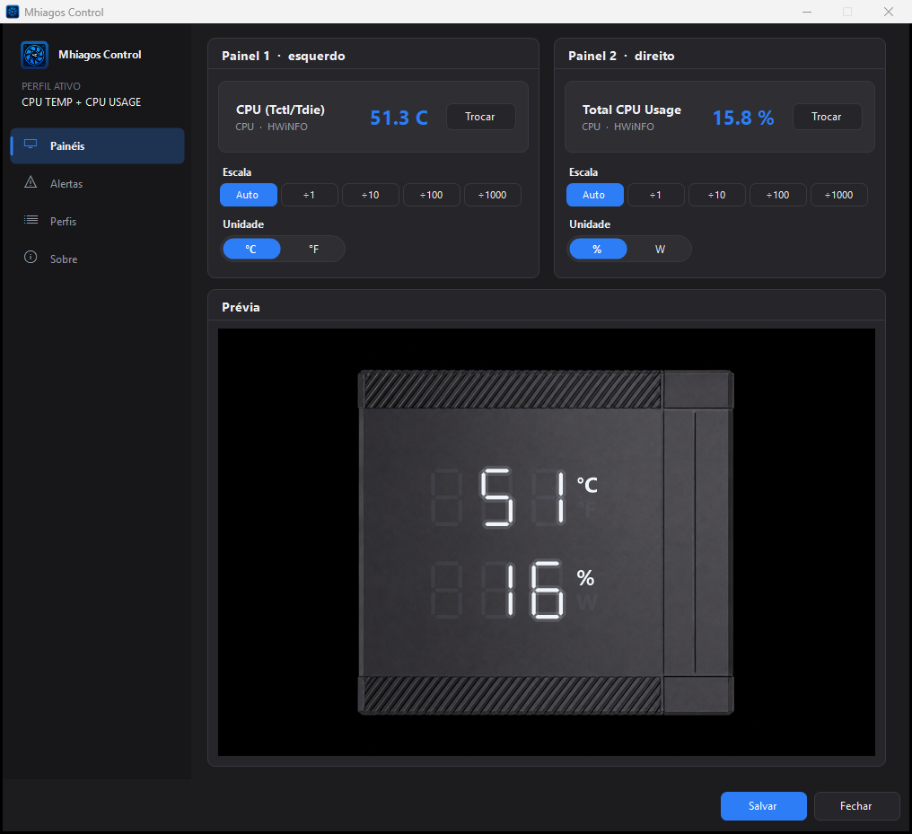
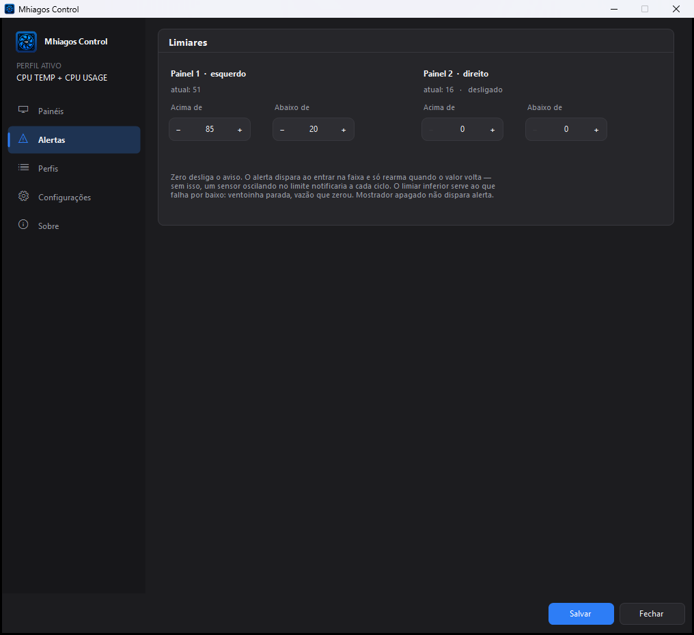
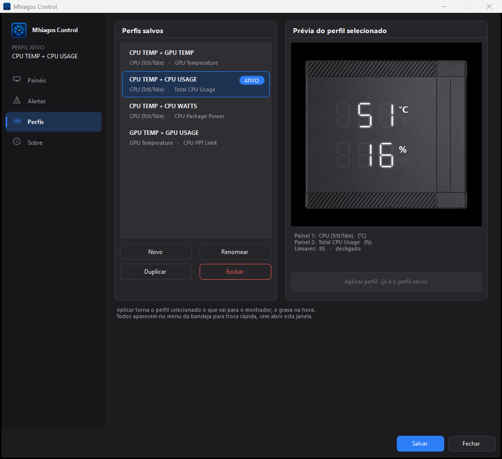
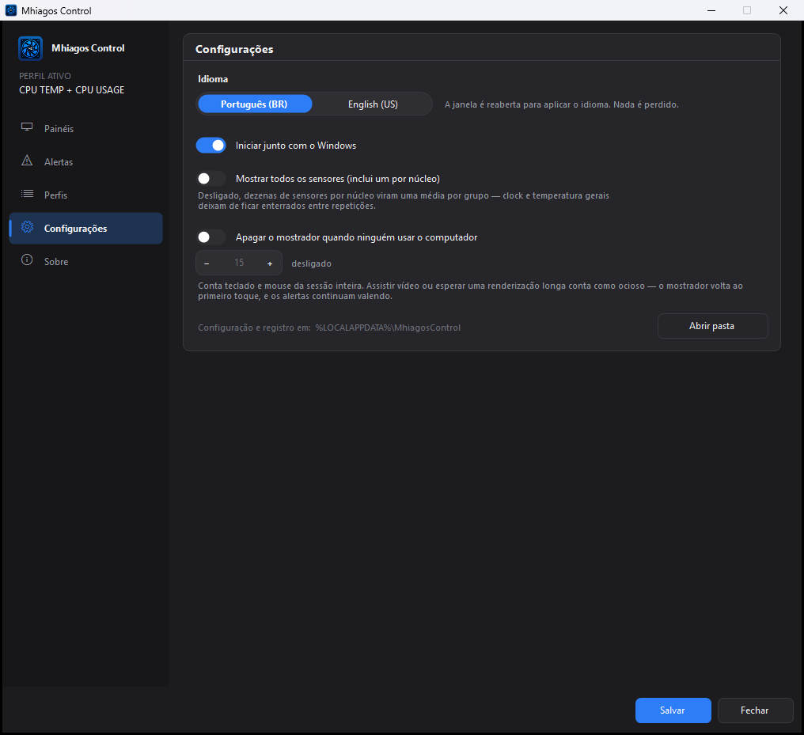
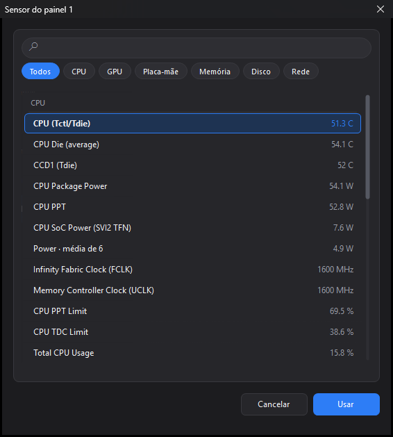
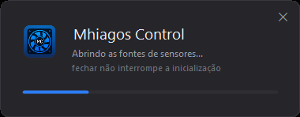

# Mhiagos Control

Driver alternativo para o painel dos **air coolers Rise Mode Temp 6, Temp 6 Pro
e Temp 8**, substituindo o software original *CPU TEMP Monitor*
(SHENZHEN SHINETEK / marca Ocypus).

Permite exibir **qualquer sensor** do sistema nos dois painéis de 3 dígitos,
em vez das duas métricas fixas que o software de fábrica oferece — com perfis
salvos, rodízio entre eles, alertas por limiar de cima e de baixo e apagamento
automático quando ninguém está usando o computador.

> A interface fala **português do Brasil e inglês**, escolhido pelo idioma do
> Windows na primeira execução e trocável em *Configurações*.

> Como o painel foi levantado, como os sensores são lidos e o que foi medido em
> vez de suposto está em **[docs/PROTOCOLO.md](docs/PROTOCOLO.md)**.

---

## Instalar

Baixe o `MhiagosControlSetup.exe` na
**[página de releases](https://github.com/Feurrado/MhiagosControl/releases/latest)**
e execute **como administrador**.

Um executável só, sem dependências: instala, cria o atalho e registra a entrada
em *Aplicativos Instalados*. O mesmo arquivo desinstala depois, conservando os
perfis. Rodar de novo por cima de uma instalação existente atualiza no lugar.

> O executável não é assinado — o SmartScreen vai mostrar *"Editor
> desconhecido"*, e é preciso clicar em **Mais informações → Executar assim
> mesmo**.

---

## Aparelhos compatíveis

- **Rise Mode Temp 6**
- **Rise Mode Temp 6 Pro**
- **Rise Mode Temp 8**

O painel é identificado pelo fabricante (**VID `1A2C`**, Shenzhen Shinetek)
somado à coleção HID *vendor-defined* `FF01`, que nenhum dispositivo comum
expõe. A mesma placa controladora sai em vários modelos da linha, com o mesmo
software de fábrica, então o casamento não depende do identificador exato de um
modelo.

A aba *Sobre* mostra o `VID / PID` do painel encontrado — é a linha para incluir
numa [issue](https://github.com/Feurrado/MhiagosControl/issues) se algo sair
diferente do esperado no seu aparelho.

---

## Telas

| | |
|:--:|:--:|
|  |  |
| **Painéis** — escolha o sensor de cada mostrador, a escala e as unidades, com prévia ao vivo sobre a peça | **Alertas** — limiar de cima e de baixo por mostrador, com rearme ao voltar à faixa |
|  |  |
| **Perfis** — cada conjunto salvo mostra o que põe no mostrador, com prévia, rodízio e exportação | **Configurações** — idioma, início automático, resumo de sensores por núcleo e apagar por ociosidade |

Preferências valem para o programa todo; perfis valem para o mostrador. Por
isso moram em páginas diferentes — as preferências ficavam dentro do *Sobre*,
entre a identidade do programa e a isenção de responsabilidade, e isso as
escondia duas vezes: quem procura uma preferência não clica em "Sobre", e quem
clica em "Sobre" quer créditos, não um formulário.

A prévia reproduz a vista superior do cooler e o mostrador de sete segmentos
como ele é no aparelho: os dois painéis empilhados, `°C`/`°F` sobre `%`/`W`,
dígitos brancos sem moldura.

### Escolha do sensor



O sensor de cada mostrador é escolhido numa janela dedicada, aberta pelo botão
*Trocar*. Ali a lista não divide altura com escala, unidade e prévia, então
cabem duas vezes mais linhas — e as pílulas de categoria reduzem a busca ao
hardware procurado. A busca por texto casa nome, categoria e tipo, todos os
termos ao mesmo tempo. Duplo clique ou <kbd>Enter</kbd> confirmam.

### Perfis

Um perfil é um par de sensores salvo junto com unidades, escala e limiares.
A lista mostra o que cada um manda para o mostrador, e selecionar um já exibe a
prévia sobre a peça antes de *Aplicar perfil* torná-lo o que está valendo —
aplicar grava na hora, então um perfil "ativo" sempre sobrevive a fechar a
janela. Todos aparecem também no menu da bandeja, para trocar sem abrir a
configuração.

*Exportar* grava o perfil selecionado num `.ini` avulso e *Importar* traz um de
volta, com nome livre se já houver outro igual. O identificador do sensor
carrega o modelo do hardware, então um perfil vindo de outra máquina entra com o
mostrador em branco — e o aplicativo diz isso na hora, em vez de deixar procurar
defeito onde não há.

### Rodízio

Marcados dois ou mais perfis, o mostrador **gira entre eles** no intervalo
escolhido. Gira perfis inteiros, e não sensores dentro de um mostrador, porque o
indicador de unidade é do quadro: `°C`/`°F` em cima e `%`/`W` embaixo valem para
os dois painéis de uma vez. Girar só o sensor poria watts sob o indicador de
porcentagem, e o mostrador mentiria sem jeito de perceber.

Os **alertas continuam seguindo o perfil ativo**, e não o que está girando:
limiares que mudassem a cada volta travariam e destravariam sozinhos, e um aviso
que aparece conforme a hora do relógio não é aviso. Girar é sobre o mostrador,
não sobre a vigilância.

### Métricas

Uma grade de cartões com as leituras da máquina, cada um com o número grande e o
histórico desenhado atrás. A primeira abertura monta um conjunto automático —
uma leitura de cada grandeza por peça, temperatura primeiro — e o botão
*Conjunto padrão* repõe esse conjunto a qualquer momento. Qualquer sensor pode
virar cartão, em três tamanhos que se reorganizam sozinhos na largura
disponível.

O histórico **não vive na janela**: é gravado em disco e alimentado pelo mesmo
ciclo que atualiza o mostrador, então continua correndo com a configuração
fechada e sobrevive a fechar o programa. São seis horas em baldes de cinco
segundos, e a janela desenhada é escolhida entre **10 min**, **1 h** e **6 h**.

Período sem leitura fica **vazio no gráfico**, e não ligado por uma reta: o
computador desligado das 3h às 8h é um buraco, não uma temperatura constante por
cinco horas.

O custo disso é medido: a leitura restrita ao mostrador visita só os grupos de
que ele depende, e uma vez a cada balde ela se abre para os grupos dos cartões,
tira a amostra e volta a fechar. Sem cartão nenhum na grade, nada disso roda.

### Tela de carregamento



Não aparece sozinha: só surge se o ícone da bandeja for clicado enquanto as
fontes de sensores ainda estão abrindo — quem estranhou a demora é quem quer
explicação. Fechá-la não interrompe nada.

> As leituras que aparecem nas capturas são **ilustrativas** — a interface foi
> renderizada com uma lista de sensores representativa, não medida de uma
> máquina específica.

---

## Requisitos

- Windows 10/11 x64
- .NET Framework 4.7.2+ (presente por padrão)
- **Privilégio administrativo** — ler temperatura da CPU exige acesso em modo
  kernel, e isso não existe sem elevação

---

## Compilar do código

Só para quem quer modificar o projeto — para instalar, use o release acima.

Não exige SDK do .NET nem NuGet: compila com o `csc.exe` que já acompanha o
Windows. É a característica que mantém o projeto simples de construir, e a razão
de o instalador também ser compilado por ele em vez de por Inno Setup ou WiX.

### Compilar

```powershell
powershell -ExecutionPolicy Bypass -File .\build.ps1
```

Saída em `bin\MhiagosControl.exe`.

> O `-ExecutionPolicy Bypass` é necessário porque o Windows barra scripts `.ps1`
> por padrão. O parâmetro vale **apenas para esse processo** e não altera a
> configuração da máquina — não é preciso rodar `Set-ExecutionPolicy`.

> **Atenção:** a pasta `bin\engine\` faz parte do conjunto. Copiar só o `.exe`
> faz o aplicativo perder temperatura, potência e clock da CPU — ele cai na
> fonte de reserva, e diz isso na aba *Sobre*.

### Gerar o instalador

```powershell
powershell -ExecutionPolicy Bypass -File .\tools\build-installer.ps1
```

Saída em `dist\MhiagosControlSetup.exe`: um executável só, com o aplicativo e as
bibliotecas embutidos como recursos.

Ele grava em `Arquivos de Programas`, cria atalho no menu Iniciar, registra a
entrada em *Aplicativos Instalados* e, se pedido, cria a tarefa de início
automático — a mesma que o aplicativo cria pelo próprio menu, o que também
conserta o caso de ela ter ficado apontando para um caminho antigo. **O mesmo
executável desinstala:** durante a instalação ele se copia para a pasta de
destino como `uninstall.exe`, e é esse caminho que vai para o registro.

A desinstalação **conserva os perfis por padrão** — apagar `%LOCALAPPDATA%\MhiagosControl`
é uma caixa desmarcada, porque reconstruir um perfil custa reescolher dois
sensores e o usuário raramente quer isso ao reinstalar.

Se `lib\api-ms-win-core-sysinfo-825-64.dll` existir, ela entra **dentro** do
executável gerado. A opção `-SemMotor` produz um instalador sem ela, e nesse
caso o aplicativo sobe na fonte de reserva e informa isso na aba *Sobre*.

`dist\` fica fora do repositório pelo `.gitignore` — são artefatos de
compilação, e o release é o lugar deles.

## Usar

1. Execute `bin\MhiagosControl.exe` (pede elevação).
2. Na primeira execução abre a janela de configuração. Escolha o sensor de
   cada painel e as unidades.
3. O ícone fica na bandeja. Duplo clique reabre a configuração.

*Salvar* grava no disco e **deixa a janela aberta** — ajuste de mostrador
raramente vem sozinho, e fechar a cada gravação só significava reabrir.
*Fechar* pergunta antes de descartar o que não foi salvo.

O software original não precisa estar instalado.

### Alertas

Cada mostrador tem dois limiares, e **zero desliga** cada um. O de cima é o
esperado; o de baixo pega o que falha por baixo — ventoinha parada, vazão de
rede que zerou, carga que despencou. O aviso dispara ao entrar na faixa e só
rearma quando o valor volta, senão um sensor oscilando no limite notificaria a
cada 1,1 s. **Mostrador em branco não dispara nada:** ausência de leitura não é
valor baixo.

### Apagar quando ocioso

Em *Configurações*, o mostrador pode apagar depois de N minutos sem teclado nem
mouse, e volta ao primeiro toque. Conta a sessão inteira do Windows, não este
programa — o que também quer dizer que assistir a um vídeo ou esperar uma
renderização longa conta como ocioso, porque ninguém digita. Os alertas seguem
valendo com o mostrador apagado: uma CPU não esfria porque o dono saiu.

### Dados do aplicativo

Ficam em `%LOCALAPPDATA%\MhiagosControl\` — acessível pelo menu da bandeja em
*Abrir pasta de dados*:

| Arquivo | Conteúdo |
|---------|----------|
| `config.ini` | perfis, sensor de cada painel, unidades, limiares, rodízio, idioma da interface |
| `log.txt` | diagnóstico, com rotação em 512 KB (`log.txt.1`) |

Configurações de versões antigas (inclusive da época em que o projeto se
chamava *RiseModePanel*) são migradas no primeiro arranque.

## O que este projeto evita do software original

- **Telemetria** para `upgrade-1318931438.cos.ap-beijing.myqcloud.com` (atualização
  automática de firmware e software a partir de um bucket na China)
- Métricas fixas: aqui qualquer sensor pode ir para qualquer painel
- A janela sempre aberta: aqui o programa vive na bandeja

---

## Licença

**MIT** — veja [`LICENSE`](LICENSE). Use, modifique e redistribua à vontade,
mantendo o aviso de copyright.

A licença cobre **o código deste repositório**. As dependências têm licença
própria e não são cobertas por ela:

| Componente | Licença |
|------------|---------|
| `src/`, `tools/`, `build.ps1`, `assets/` gerados | MIT |
| `lib/LibreHardwareMonitorLib.dll` | MPL 2.0 (veja `lib/LibreHardwareMonitor-LICENSE.txt`) |
| `engine\api-ms-win-core-sysinfo-825-64.dll` | © REALiX s.r.o. |

---

## Créditos

- [LibreHardwareMonitor](https://github.com/LibreHardwareMonitor/LibreHardwareMonitor) —
  fonte de reserva (MPL 2.0). Licença em `lib/LibreHardwareMonitor-LICENSE.txt`.
- **HWiNFO32 Client Library** — © REALiX s.r.o.
- Protocolo do painel: engenharia reversa para interoperabilidade com hardware
  próprio.
- Feito por [Feurrado](https://github.com/Feurrado).

---

## Isenção de responsabilidade

Este é um projeto **pessoal, independente e sem fins lucrativos**, feito para
interoperar com hardware que o autor possui. Não tem qualquer vínculo,
patrocínio, afiliação ou aprovação da Rise Mode, da Ocypus, da SHENZHEN
SHINETEK, da REALiX s.r.o. ou de qualquer outro fabricante. Todas as marcas
citadas pertencem aos seus respectivos donos e aparecem apenas para identificar
o equipamento com que o programa se comunica.

O protocolo do painel foi levantado por **engenharia reversa do próprio
equipamento**, com a finalidade exclusiva de interoperabilidade — o programa
não contém, não copia e não redistribui código do software original.

> O PROGRAMA É FORNECIDO "COMO ESTÁ", SEM GARANTIA DE QUALQUER TIPO, EXPRESSA OU
> IMPLÍCITA, INCLUINDO AS DE COMERCIALIZAÇÃO, ADEQUAÇÃO A UM FIM ESPECÍFICO E
> NÃO VIOLAÇÃO. O USO É POR CONTA E RISCO DE QUEM O EXECUTA. EM NENHUMA HIPÓTESE
> O AUTOR RESPONDE POR QUALQUER DANO, DIRETO OU INDIRETO, INCLUINDO DANO A
> EQUIPAMENTO, PERDA DE DADOS OU LUCROS CESSANTES, DECORRENTE DO USO OU DA
> IMPOSSIBILIDADE DE USO DESTE PROGRAMA.

Usar este programa pode implicar a **perda da garantia do equipamento**.
Verifique antes.

O mesmo texto aparece dentro do aplicativo, na aba *Sobre*.
