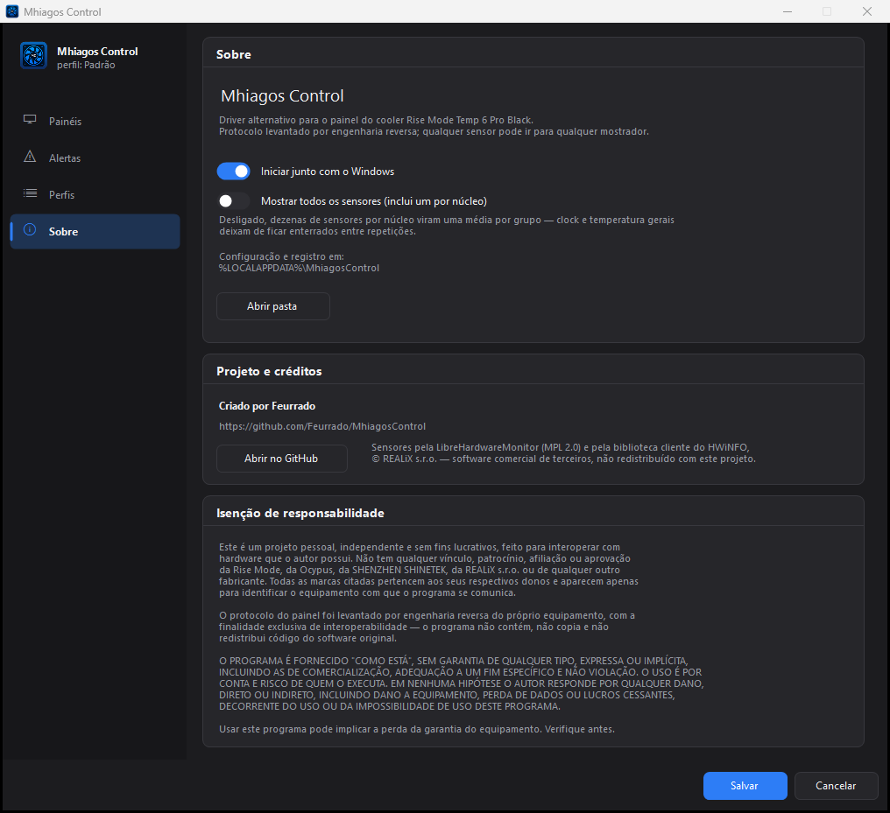

# Mhiagos Control

Driver alternativo para o painel do **air cooler Rise Mode Temp 6 Pro Black**,
substituindo o software original *CPU TEMP Monitor*
(SHENZHEN SHINETEK / marca Ocypus).

Permite exibir **qualquer sensor** do sistema nos dois painéis de 3 dígitos,
em vez das duas métricas fixas que o software de fábrica oferece — com perfis
salvos, rodízio entre eles, alertas por limiar de cima e de baixo e apagamento
automático quando ninguém está usando o computador.

> A interface fala **português do Brasil e inglês**, escolhido pelo idioma do
> Windows na primeira execução e trocável em *Configurações*.

---

## Telas

| | |
|:--:|:--:|
|  |  |
| **Painéis** — escolha o sensor de cada mostrador, a escala e as unidades, com prévia ao vivo sobre a peça | **Alertas** — limiar de cima e de baixo por mostrador, com rearme ao voltar à faixa |
|  |  |
| **Perfis** — cada conjunto salvo mostra o que põe no mostrador, com prévia, rodízio e exportação | **Configurações** — idioma, início automático, resumo de sensores por núcleo e apagar por ociosidade |

Preferências valem para o programa todo; perfis valem para o mostrador. Por
isso moram em páginas diferentes — as preferências ficavam dentro do *Sobre*,
entre a identidade do programa e a isenção de responsabilidade, e isso as
escondia duas vezes: quem procura uma preferência não clica em "Sobre", e quem
clica em "Sobre" quer créditos, não um formulário.

A prévia reproduz a vista superior do cooler e o mostrador de sete segmentos
como ele é no aparelho: os dois painéis empilhados, `°C`/`°F` sobre `%`/`W`,
dígitos brancos sem moldura.

### Escolha do sensor


O sensor de cada mostrador é escolhido numa janela dedicada, aberta pelo botão
*Trocar*. Ali a lista não divide altura com escala, unidade e prévia, então
cabem duas vezes mais linhas — e as pílulas de categoria reduzem a busca ao
hardware procurado. A busca por texto casa nome, categoria e tipo, todos os
termos ao mesmo tempo. Duplo clique ou <kbd>Enter</kbd> confirmam.

### Perfis

Um perfil é um par de sensores salvo junto com unidades, escala e limiares.
A lista mostra o que cada um manda para o mostrador, e selecionar um já exibe a
prévia sobre a peça antes de *Aplicar perfil* torná-lo o que está valendo —
aplicar grava na hora, então um perfil "ativo" sempre sobrevive a fechar a
janela. Todos aparecem também no menu da bandeja, para trocar sem abrir a
configuração.

*Exportar* grava o perfil selecionado num `.ini` avulso e *Importar* traz um de
volta, com nome livre se já houver outro igual. O identificador do sensor
carrega o modelo do hardware, então um perfil vindo de outra máquina entra com o
mostrador em branco — e o aplicativo diz isso na hora, em vez de deixar procurar
defeito onde não há.

### Rodízio

Marcados dois ou mais perfis, o mostrador **gira entre eles** no intervalo
escolhido. Gira perfis inteiros, e não sensores dentro de um mostrador, porque o
indicador de unidade é do quadro: `°C`/`°F` em cima e `%`/`W` embaixo valem para
os dois painéis de uma vez. Girar só o sensor poria watts sob o indicador de
porcentagem, e o mostrador mentiria sem jeito de perceber.

Os **alertas continuam seguindo o perfil ativo**, e não o que está girando:
limiares que mudassem a cada volta travariam e destravariam sozinhos, e um aviso
que aparece conforme a hora do relógio não é aviso. Girar é sobre o mostrador,
não sobre a vigilância.

### Tela de carregamento


Não aparece sozinha: só surge se o ícone da bandeja for clicado enquanto as
fontes de sensores ainda estão abrindo — quem estranhou a demora é quem quer
explicação. Fechá-la não interrompe nada.

> As leituras que aparecem nas capturas são **ilustrativas** — a interface foi
> renderizada com uma lista de sensores representativa, não medida de uma
> máquina específica.

---

## Protocolo do painel

Levantado por engenharia reversa: captura USB do software original (USBPcap),
decodificação byte a byte e validação por escrita direta no dispositivo.

**Dispositivo:** `VID 0x1A2C` / `PID 0x4984`
O firmware se identifica como *"USB Gaming Keyboard"* — descritor genérico
reaproveitado do fabricante do microcontrolador. O canal real de dados é a
coleção HID *vendor-defined* com `UsagePage 0xFF01`.

**Transporte:** transferência de controle no EP0 — `SET_REPORT` da classe HID.

```
Setup: 21 09 07 03 01 00 40 00
       │  │  │  │  │     └── wLength = 64
       │  │  │  │  └──────── wIndex  = 1 (interface)
       │  │  └──┴─────────── wValue  = 0x0307 (tipo 3 = Feature, ReportID 7)
       │  └───────────────── bRequest = 0x09 (SET_REPORT)
       └──────────────────── bmRequestType = 0x21 (OUT | Class | Interface)
```

**Payload — 64 bytes:**

| Byte | Conteúdo |
|------|----------|
| `[0]` | `0x07` — ReportID |
| `[1]` | centena do painel 1 |
| `[2]` | dezena do painel 1 |
| `[3]` | unidade do painel 1 |
| `[4]` | flags — `bit0 (0x01)` = °F ; `bit4 (0x10)` = % |
| `[5]` | centena do painel 2 |
| `[6]` | dezena do painel 2 |
| `[7]` | unidade do painel 2 |
| `[8..63]` | `0x00` |

Os dígitos são enviados **separados, um por byte, em decimal direto** — não é BCD
compactado nem inteiro binário. Para exibir `73`, envia-se `0`, `7`, `3`.
Os códigos `0x0A`–`0x0F` **apagam** o dígito.

**Sem checksum, sem criptografia, sem número de sequência.**

O byte de dígito é um **índice de tabela no firmware**, não um mapa de
segmentos. A prova é `0x00`: se fosse bitmap acenderia nada, e acende o `0`.
Não há, portanto, como desenhar figuras ou animar segmentos avulsos — o painel
escreve os dez algarismos e mais nada. Para varrer o que resta do protocolo,
veja `tools\Probe.cs` em *Ferramentas*.

### Flags (`report[4]`)

Os dois bits são **independentes** — as quatro combinações são válidas:

| Valor | Painel 1 | Painel 2 |
|-------|----------|----------|
| `0x00` | °C | W |
| `0x01` | °F | W |
| `0x10` | °C | % |
| `0x11` | °F | % |

O bit apenas **acende o símbolo**; a conversão numérica é responsabilidade do
software. O software original usa a centena exclusivamente para Fahrenheit,
que ultrapassa 99 — mas a faixa `000–999` está integralmente disponível nos
dois painéis, validada por escrita.

### Watchdog

O firmware apaga o painel se parar de receber atualizações. É obrigatório
reenviar continuamente. O software original usa cadência de **~1105 ms**
(medida: desvio inferior a 1%). Este projeto usa 1100 ms.

---

## Fontes de sensores

O aplicativo tem duas fontes e escolhe a melhor disponível no arranque.

### HWiNFO (preferida)

`engine\api-ms-win-core-sysinfo-825-64.dll` é a **biblioteca cliente do HWiNFO**
(HWiNFO32 Client Library 8.25, REALiX s.r.o.), distribuída pelo fabricante do
cooler com nome de API do Windows. É o mesmo motor que o software original usa
para ler temperatura — e a razão de ele funcionar onde a LibreHardwareMonitor
falha: seu driver é assinado WHQL pela Microsoft e **não** consta na lista de
drivers vulneráveis.

A biblioteca exporta **797 funções, nenhuma com nome** — só por ordinal. A
correspondência abaixo foi recuperada do `DeviceDriver.exe` original,
localizando os `GetProcAddress` e decodificando os *call sites*. Todas são
`cdecl`:

| Ordinal | Assinatura | Papel |
|---------|-----------|-------|
| `850` | `int Init(0xC0)` | inicializa; devolve 0 em caso de sucesso |
| `156` | `int GetCount()` | quantidade de grupos de sensores |
| `263` | `int (void)` | chamada uma vez por ciclo, após a contagem |
| `678` | `int (int i)` | prepara o grupo `i` |
| `952` | `int (int i, char* buf, int tam)` | nome do grupo `i` |
| `641` | `int (int classe, int i, int j, void* elem)` | leitura `j` do grupo `i`; `0` encerra a série |
| `398`, `613` | — | resolvidos e validados pelo original, não usados na leitura |

O elemento devolvido por `641` tem **464 bytes** (`0x1D0`):

| Offset | Campo |
|--------|-------|
| `+0x08` | valor (`double`) |
| `+0x10` | unidade, ASCII (`"°C"`, `"W"`, `"MHz"`, `"MB"`…) |
| `+0x30` | categoria de hardware (`10` sistema, `11` CPU, `12` placa-mãe, `13` GPU, `15` disco, `16` rede) |
| `+0x148` | rótulo da leitura |

O primeiro argumento de `641` é a **classe de leitura**: `1` temperatura,
`2` voltagem, `3` ventoinha, `4` corrente, `5` potência, `6` clock, `7` uso,
`8` outros. O software original só consulta a classe 1 — daí ele exibir
temperatura pelo HWiNFO e watts pela outra fonte.

O `Init` falha com código **1** sem elevação, porque a biblioteca precisa
registrar e subir seu driver.

> **A DLL não está neste repositório** — é software comercial de terceiros e
> não pode ser redistribuída (veja *Licença*).

#### Como colocar a biblioteca na sua instalação

Ela é carregada **apenas de `bin\engine\`**. O aplicativo não lê da pasta do
software de fábrica: fazer isso o deixaria preso ao programa que ele existe para
substituir, e desinstalar o original tiraria temperatura e potência sem dizer
nada em tela.

Há dois caminhos, e os dois são você copiando um arquivo que já veio com o
produto que comprou — não o projeto redistribuindo:

1. **Na primeira execução**, se a biblioteca não estiver em `engine\` e o *CPU
   TEMP Monitor* estiver instalado, o aplicativo encontra a cópia e **pergunta**
   se quer trazê-la. Um clique e a instalação fica autônoma; o software de
   fábrica pode ser desinstalado depois.
2. **Ao compilar**, ponha `api-ms-win-core-sysinfo-825-64.dll` em `lib\` e o
   `build.ps1` a copia para `bin\engine\`. Sem ela o script avisa.

Se nenhum dos dois acontecer, o aplicativo sobe com a fonte de reserva e diz
isso **na aba Sobre**, em *Fontes de sensores* — não só no log.




Sem o *CPU TEMP Monitor* instalado e sem uma cópia guardada, a biblioteca só
vem do instalador que acompanha o produto.

### LibreHardwareMonitor (reserva)

Usada apenas quando o HWiNFO não está disponível. Cobre GPU, uso de CPU,
memória, disco e rede sem driver próprio, mas **devolve zero** em temperatura,
potência e clock real do processador: esses exigem acesso em modo kernel, e o
driver que ela usa para isso (WinRing0 1.2.0.5, CVE-2020-14979) está na lista de
bloqueio do Windows. O antivírus o remove **a cada inicialização**, com alerta.

É por isso que ela não é aberta quando o HWiNFO responde: não há o que ganhar
pagando esse preço.

---

## Requisitos

- Windows 10/11 x64
- .NET Framework 4.7.2+ (presente por padrão)
- **Privilégio administrativo** — as duas fontes precisam subir um driver

Não exige SDK do .NET: compila com o `csc.exe` que acompanha o Windows.

## Compilar

```powershell
powershell -ExecutionPolicy Bypass -File .\build.ps1
```

Saída em `bin\MhiagosControl.exe`.

> O `-ExecutionPolicy Bypass` é necessário porque o Windows barra scripts `.ps1`
> por padrão. O parâmetro vale **apenas para esse processo** e não altera a
> configuração da máquina — não é preciso rodar `Set-ExecutionPolicy`.

> **Atenção ao distribuir:** a pasta `bin\engine\` faz parte do conjunto. Copiar
> só o `.exe` faz o aplicativo perder silenciosamente temperatura, potência e
> clock da CPU — ele cai na fonte de reserva sem avisar em tela, apenas no log.

## Instalador

```powershell
powershell -ExecutionPolicy Bypass -File .\tools\build-installer.ps1
```

Saída em `dist\MhiagosControlSetup.exe`: um executável só, com o aplicativo e as
bibliotecas embutidos como recursos. Compila com o mesmo `csc.exe` do resto —
depender do Inno Setup ou do WiX contradiria a única característica que torna
este projeto fácil de compilar.

Ele grava em `Arquivos de Programas`, cria atalho no menu Iniciar, registra a
entrada em *Aplicativos Instalados* e, se pedido, cria a tarefa de início
automático — a mesma que o aplicativo cria pelo próprio menu, o que também
conserta o caso de ela ter ficado apontando para um caminho antigo. **O mesmo
executável desinstala:** durante a instalação ele se copia para a pasta de
destino como `uninstall.exe`, e é esse caminho que vai para o registro.

A desinstalação **conserva os perfis por padrão** — apagar `%LOCALAPPDATA%\MhiagosControl`
é uma caixa desmarcada, porque reconstruir um perfil custa reescolher dois
sensores e o usuário raramente quer isso ao reinstalar.

> **O instalador gerado não é distribuível.** Se `lib\api-ms-win-core-sysinfo-825-64.dll`
> existir, ela entra **dentro** do executável — e é software comercial da REALiX,
> licenciado ao fabricante do cooler, não a este projeto. Um instalador assim
> serve a uso pessoal na própria máquina e não pode ser publicado, enviado a
> ninguém nem virar Release no GitHub. Por isso `dist\` está no `.gitignore`.
>
> Para um instalador distribuível, use `-SemMotor`: ele sai sem a biblioteca, e
> o aplicativo sobe na fonte de reserva avisando na aba *Sobre*.

## Usar

1. Execute `bin\MhiagosControl.exe` (pede elevação).
2. Na primeira execução abre a janela de configuração. Escolha o sensor de
   cada painel e as unidades.
3. O ícone fica na bandeja. Duplo clique reabre a configuração.

*Salvar* grava no disco e **deixa a janela aberta** — ajuste de mostrador
raramente vem sozinho, e fechar a cada gravação só significava reabrir.
*Fechar* pergunta antes de descartar o que não foi salvo.

O software original não precisa estar instalado.

### Alertas

Cada mostrador tem dois limiares, e **zero desliga** cada um. O de cima é o
esperado; o de baixo pega o que falha por baixo — ventoinha parada, vazão de
rede que zerou, carga que despencou. O aviso dispara ao entrar na faixa e só
rearma quando o valor volta, senão um sensor oscilando no limite notificaria a
cada 1,1 s. **Mostrador em branco não dispara nada:** ausência de leitura não é
valor baixo.

### Apagar quando ocioso

Em *Configurações*, o mostrador pode apagar depois de N minutos sem teclado nem
mouse, e volta ao primeiro toque. Conta a sessão inteira do Windows, não este
programa — o que também quer dizer que assistir a um vídeo ou esperar uma
renderização longa conta como ocioso, porque ninguém digita. Os alertas seguem
valendo com o mostrador apagado: uma CPU não esfria porque o dono saiu.

### Dados do aplicativo

Ficam em `%LOCALAPPDATA%\MhiagosControl\` — acessível pelo menu da bandeja em
*Abrir pasta de dados*:

| Arquivo | Conteúdo |
|---------|----------|
| `config.ini` | perfis, sensor de cada painel, unidades, limiares, rodízio, idioma da interface |
| `log.txt` | diagnóstico, com rotação em 512 KB (`log.txt.1`) |

Configurações de versões antigas (inclusive da época em que o projeto se
chamava *RiseModePanel*) são migradas no primeiro arranque.

### Notas de implementação

- A leitura de sensores roda em **thread própria**: percorrer o hardware leva
  dezenas a centenas de ms e travaria a interface se fosse feita na thread de
  UI. Só a atualização do tooltip volta para a UI.
- A cadência é **compensada**: o laço desconta o tempo gasto no ciclo, mantendo
  1100 ms reais independentemente da carga da máquina.
- **Instância única** garantida por mutex — duas instâncias disputariam o painel.
- A biblioteca do HWiNFO não expõe consulta individual, então a enumeração
  visita grupo por grupo. **Preparar um grupo (ordinal `678`) custa ~2,9 ms; as
  169 leituras que vêm depois custam praticamente zero.** O preço do ciclo é o
  número de grupos, e nada mais. Por isso, com a janela fechada, o aplicativo lê
  **apenas os grupos dos sensores que estão no mostrador** — os do perfil ativo
  mais os de todos os perfis do rodízio. Medido nesta máquina, com 19 grupos e
  169 sensores: **55,7 ms por ciclo lendo tudo, 4,3 ms lendo dirigido.**
- O identificador do sensor guarda o **nome** do grupo, não o índice. O índice é
  cacheado, mas **nunca usado sem conferir o nome** depois de selecionar (custa
  0,001 ms): se não bater, o aplicativo refaz a varredura completa e reaprende.
  Sem essa conferência, um dispositivo aparecendo ou sumindo faria o mostrador
  ler o sensor errado em silêncio — o pior modo de falhar que este programa tem.
- `List()` e `Snapshot()` **completam sozinhos** se o último ciclo foi dirigido.
  A garantia mora neles e não em quem chama, porque esquecer seria silencioso: o
  seletor apareceria com dois sensores em vez de 138, e o defeito se pareceria
  com "sumiram sensores", longe da causa.
- Sensores por núcleo são **resumidos em médias** (clock, potência, tensão, uso),
  para não enterrar os sensores gerais. Desligável em *Mostrar todos os sensores*.
- A conversão para Fahrenheit só se aplica a sensores do tipo `Temperature`.
- A **unidade vem da fonte**, não do tipo do sensor: o HWiNFO devolve memória em
  `MB` e o rótulo genérico do tipo dizia `GB` sobre o número errado. Leituras em
  `MB` são convertidas para `GB` e exibidas com uma casa (`11.6 GB`).
- O seletor de unidade do painel 2 **acompanha a métrica**: escolher um sensor de
  potência acende `W`, um de uso acende `%`.
- Valores acima de 999 são limitados pelo hardware; o tooltip sinaliza com
  `[excede 999]`. Divisores por sensor permitem caber métricas maiores.
- **Início automático** por Tarefa Agendada com `/rl highest`: a chave `Run` do
  registro não serve para aplicativos elevados.
- `SessionEnding` encerra a thread antes de fechar as fontes.
- A **tela de carregamento vive em thread própria**, com laço de mensagens
  próprio. Pendurada na thread principal ela travava: durante a subida do driver
  o `LoadLibrary` segura o cadeado do carregador, o Windows marca a janela como
  travada e passa a engolir os cliques — não dava para fechá-la.
- As **barras de rolagem são desenhadas pelo aplicativo**. A nativa entra como um
  risco claro sobre o cartão escuro mesmo com `DarkMode_Explorer`, e não aceita
  espessura nem raio. Escondê-la tem um efeito colateral: o `ListBox` só rola com
  a roda enquanto a barra nativa está visível, então a roda também passou a ser
  tratada na mão, pelo `TopIndex`.
- A altura da lista é **acertada para um múltiplo da linha**; a sobra vira recheio
  do painel. Sem isso a última linha aparecia cortada ao meio, como se houvesse
  item escondido onde não havia.
- **Trocar de idioma reabre a janela** em vez de reetiquetá-la viva. Reetiquetar
  exigiria que cada controle guardasse a chave do seu texto e soubesse se
  retraduzir — dezenas de pontos, e o que escapasse ficaria no idioma antigo sem
  ninguém notar. Reconstruir não deixa canto por traduzir. As edições pendentes
  vão para o perfil antes, então nada se perde.
- Os nomes de categoria são **guardados em português e traduzidos na hora de
  desenhar**. São chave de agrupamento, não texto de tela; traduzi-los na origem
  quebraria a comparação que põe cada sensor sob o cabeçalho certo.
- A **busca de sensor casa os dois nomes** da categoria, então digitar "memory"
  acha o que a interface em inglês chama Memory e a configuração chama `Memória`.
- A thread de atualização **nunca lê a configuração viva**. Quem edita publica um
  clone; ela só lê a referência, o que é atômico. Antes, criar ou excluir perfil
  no momento errado lançava exceção no meio do ciclo, e o mostrador podia exibir
  um perfil pela metade.
- A posição no rodízio é **derivada do relógio**, não somada a cada volta. O ciclo
  dura 1100 ms mais o que a varredura levar, e um contador incrementado "quando
  der" acumularia esse resto até o rodízio de 20 s virar de 23.
- A ociosidade vem de `GetLastInputInfo` com **aritmética sem sinal**:
  `GetTickCount` dá a volta a cada 49,7 dias, e a subtração em `uint` continua
  certa na volta.

### Testes

```powershell
powershell -ExecutionPolicy Bypass -File .\tools\build-tests.ps1
```

Sem framework de propósito: o projeto compila com o `csc.exe` que vem no Windows,
e uma dependência de teste custaria exatamente a propriedade que o torna fácil de
compilar. Os testes compilam **contra os fontes**, e não contra o executável,
para alcançar o que é interno sem abrir visibilidade só para poder testar.

Cobrem o que a interface não denuncia: a montagem do quadro de 64 bytes, o
preparo do valor para três dígitos, a formatação da leitura, a ida e volta da
configuração, o rodízio e a completude das traduções. Dois deles varrem por
reflexão em vez de listar à mão — **todo campo do perfil** (cópia, INI,
exportação) e **todo texto de interface nos dois idiomas** — porque o modo de
falhar é sempre acrescentar algo e esquecer de uma das pontas, e uma lista
escrita à mão esqueceria junto.

### Medição

```powershell
powershell -ExecutionPolicy Bypass -File .\tools\build-bench.ps1
.\bin\Bench.exe
```

Mede alocação e tempo por ciclo com `AppDomain.MonitoringTotalAllocatedMemorySize`
— que conta bytes alocados de verdade, enquanto `GC.GetTotalMemory` só mostra o
que sobreviveu, e lixo de vida curta é exatamente o caso aqui. Precisa de
elevação, como o aplicativo: sem ela as fontes abrem pela metade e a medição
mede outra máquina.

Existe porque a alternativa era otimizar por leitura de código. Dá para contar as
alocações de um ciclo com o dedo na tela e chegar a um número grande; o que a
conta não diz é se esse número importa perto do que a varredura do hardware
custa sozinha.

Não importava. As 169 KB por ciclo dão **87 coletas de geração 0 por hora**, e
nenhuma de geração 1 ou 2 — reaproveitar objetos entre ciclos não ganharia nada.
O banco também descartou pular as sondas que encerram cada série: **0,14 ms de
56**. O que ele achou foi outra coisa, que só apareceu porque a medição foi feita
com privilégio administrativo e a fonte boa ativa — sem elevação o HWiNFO nem
abre, e o banco mede a fonte que o aplicativo não usa.

A seção *leitura dirigida* confere primeiro que o atalho não muda o resultado, e
só depois mede o ganho. O modo de falhar que interessa ali não é lentidão: é a
lista vir truncada sem ninguém perceber, porque os dois mostradores continuam
certos e o que some é o resto.

---

## Ferramentas

`tools\Probe.cs` — sonda interativa do protocolo, para varrer o que ainda não
foi mapeado: códigos de dígito acima de `0x0F`, os 56 bytes que o software
original sempre zera, outros ReportIDs e a cadência máxima que o firmware
aceita.

```powershell
powershell -ExecutionPolicy Bypass -File .\tools\build-probe.ps1
.\bin\Probe.exe
```

Um laço de fundo reenvia o quadro atual a cada 400 ms — sem isso o watchdog
apaga o painel enquanto se olha para ele. **Não precisa de elevação:** falar HID
com o dispositivo não envolve driver.

| Comando | Efeito |
|---------|--------|
| `b <i> <hex>` | escreve um byte na posição `i` do quadro |
| `v <i>` | varre `00`–`FF` na posição `i`, passo a passo |
| `va <i> [ms]` | a mesma varredura, automática |
| `r <hex...>` | substitui o quadro inteiro |
| `hz <ms>` | muda a cadência de reenvio |
| `anim [ms]` | anima os dígitos, para medir o limite de atualização |
| `un` | percorre os dois nibbles de `report[4]`, um indicador de cada vez |
| `ids` | tenta outros ReportIDs |
| `q` | sai |

### Não há como apagar os indicadores de unidade

Um dos dois símbolos de cada par fica **sempre aceso**: `°C` ou `°F` em cima,
`%` ou `W` embaixo. O protocolo alterna dentro do par e não tem estado apagado.
Isso foi procurado a fundo e não existe — segue o que foi varrido, para que
ninguém precise refazer:

| Onde | Como | Resultado |
|------|------|-----------|
| Os seis bits sem mapa de `report[4]` | os 16 valores de cada nibble, com os dígitos fixos em `123`/`456` | só `bit0` e `bit4` fazem alguma coisa; os outros seis são inertes |
| Outros ReportIDs | `ids`, os 255 | só o `0x07` é aceito |
| Códigos de dígito de `0x10` a `0xFF` | sondagem nas posições `1` e `5` | nenhum apaga os símbolos |
| Os 56 bytes que o software original zera | sondagem em `8`, `9` e `10` | nada muda |

A explicação mais simples para o conjunto é que o firmware acende um dos dois
símbolos incondicionalmente, sem terceiro caso — e se os dois forem um par
complementar no mesmo pino, é impossível eletricamente, não só no protocolo.

Vale registrar a ausência com o mesmo cuidado de um achado: é a diferença entre
"ninguém tentou" e "foi tentado e não está aí", e só a segunda dispensa tentar
de novo.

**Consequência para quem usa o aplicativo:** ao pôr no mostrador uma métrica que
não é temperatura nem porcentagem — RPM, MHz, vazão — um símbolo errado vai
ficar aceso do lado do número, e a escolha possível é qual dos dois incomoda
menos. A única saída de verdade é física: uma fita opaca sobre o símbolo.

---

## O que este projeto evita do software original

- **Telemetria** para `upgrade-1318931438.cos.ap-beijing.myqcloud.com` (atualização
  automática de firmware e software a partir de um bucket na China)
- **O driver WinRing0**, que o original também carrega pela sua segunda fonte de
  sensores e que hoje é bloqueado pelo Windows
- Métricas fixas: aqui qualquer sensor pode ir para qualquer painel

---

## Licença

**MIT** — veja [`LICENSE`](LICENSE). Use, modifique e redistribua à vontade,
mantendo o aviso de copyright.

A licença cobre **o código deste repositório**. As dependências têm licença
própria e não são cobertas por ela:

| Componente | Licença |
|------------|---------|
| `src/`, `tools/`, `build.ps1`, `assets/` gerados | MIT |
| `lib/LibreHardwareMonitorLib.dll` | MPL 2.0 (veja `lib/LibreHardwareMonitor-LICENSE.txt`) |
| `engine\api-ms-win-core-sysinfo-825-64.dll` | comercial, © REALiX s.r.o. — **não redistribuir**, não está neste repositório |

---

## Créditos

- [LibreHardwareMonitor](https://github.com/LibreHardwareMonitor/LibreHardwareMonitor) —
  fonte de reserva (MPL 2.0). Licença em `lib/LibreHardwareMonitor-LICENSE.txt`.
- **HWiNFO32 Client Library** — © REALiX s.r.o. Biblioteca **comercial**,
  licenciada ao fabricante do cooler, não a este projeto. A cópia em `engine\`
  veio da instalação do software que acompanha o produto e serve a uso pessoal
  na própria máquina. **Não redistribuir.** Para uso legítimo em software
  próprio, licencie o SDK com a REALiX ou consuma o HWiNFO pela interface de
  memória compartilhada documentada.
- Protocolo do painel: engenharia reversa para interoperabilidade com hardware
  próprio.
- Feito por [Feurrado](https://github.com/Feurrado).

---

## Isenção de responsabilidade

Este é um projeto **pessoal, independente e sem fins lucrativos**, feito para
interoperar com hardware que o autor possui. Não tem qualquer vínculo,
patrocínio, afiliação ou aprovação da Rise Mode, da Ocypus, da SHENZHEN
SHINETEK, da REALiX s.r.o. ou de qualquer outro fabricante. Todas as marcas
citadas pertencem aos seus respectivos donos e aparecem apenas para identificar
o equipamento com que o programa se comunica.

O protocolo do painel foi levantado por **engenharia reversa do próprio
equipamento**, com a finalidade exclusiva de interoperabilidade — o programa
não contém, não copia e não redistribui código do software original.

> O PROGRAMA É FORNECIDO "COMO ESTÁ", SEM GARANTIA DE QUALQUER TIPO, EXPRESSA OU
> IMPLÍCITA, INCLUINDO AS DE COMERCIALIZAÇÃO, ADEQUAÇÃO A UM FIM ESPECÍFICO E
> NÃO VIOLAÇÃO. O USO É POR CONTA E RISCO DE QUEM O EXECUTA. EM NENHUMA HIPÓTESE
> O AUTOR RESPONDE POR QUALQUER DANO, DIRETO OU INDIRETO, INCLUINDO DANO A
> EQUIPAMENTO, PERDA DE DADOS OU LUCROS CESSANTES, DECORRENTE DO USO OU DA
> IMPOSSIBILIDADE DE USO DESTE PROGRAMA.

Usar este programa pode implicar a **perda da garantia do equipamento**.
Verifique antes.

O mesmo texto aparece dentro do aplicativo, na aba *Sobre*.
